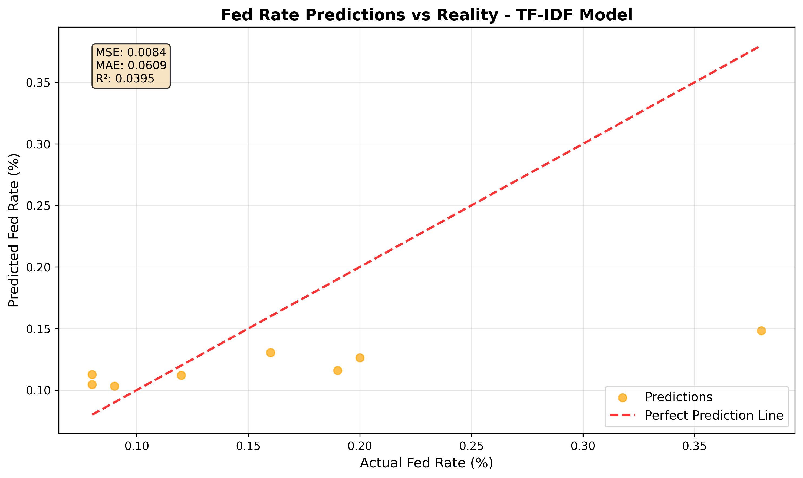
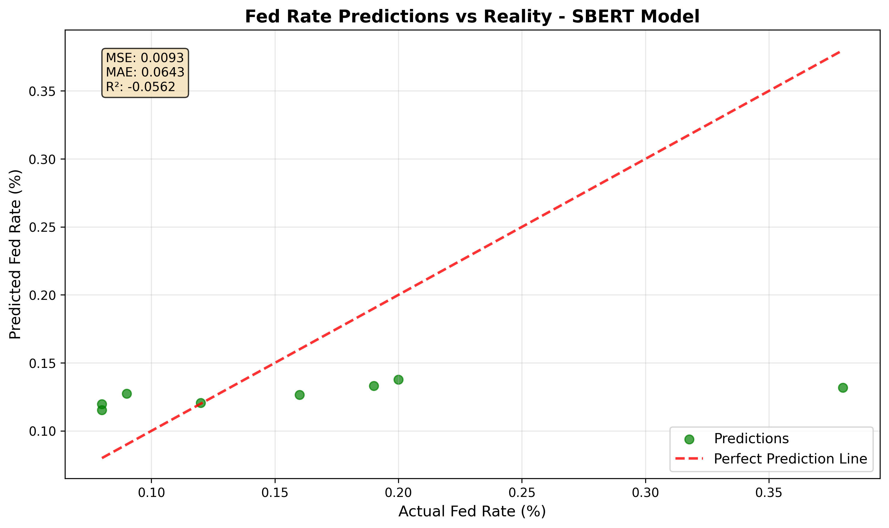
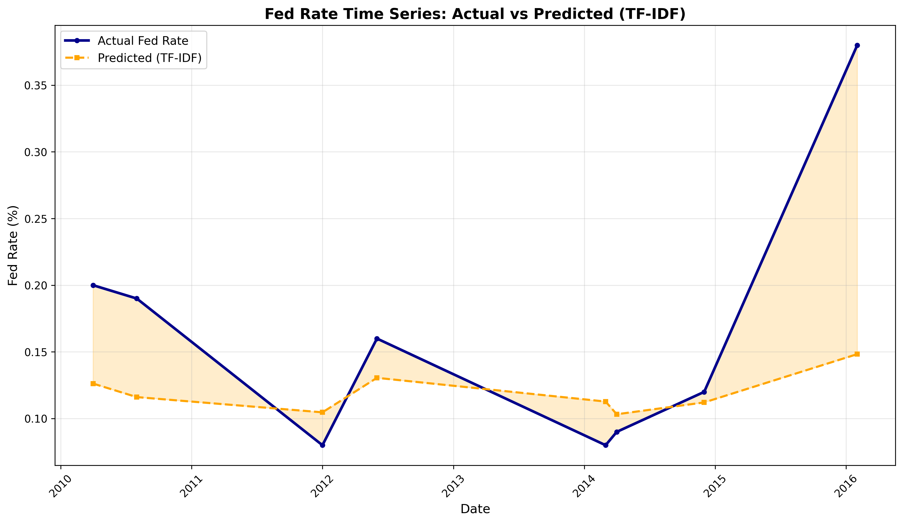
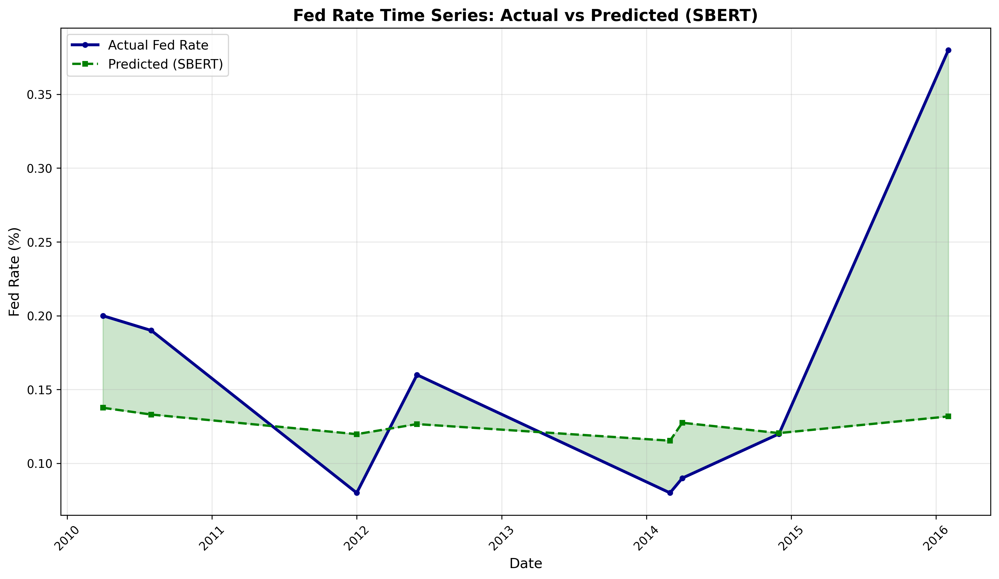

# Financial News Sentiment Analysis & Fed Rate Prediction

A Natural Language Processing project that explores semantic relationships between financial news sentiment and Federal Reserve monetary policy decisions. This project demonstrates advanced NLP techniques in quantitative finance by investigating how media narratives can predict and explain interest rate movements through transformer-based semantic analysis.

## Research Subject

In this project, we explore semantic similarity between different financial periods based on sentiments expressed in financial news headlines. Using advanced natural language processing techniques, we collect and analyze a comprehensive set of financial news headlines covering the critical period of 2008-2013, including the financial crisis and economic recovery phase.

Our primary focus is on extracting and cleaning financial news headlines to capture dominant narratives that influence Federal Reserve monetary policy decisions. To analyze these textual contents, we use Transformer-based language models (SBERT) to encode textual content into vectors that capture semantic similarity of words and financial concepts.

These embeddings are used to calculate similarity scores between different temporal periods based on their dominant economic narratives. Our objective is to identify natural clusters or proximities between different economic phases, potentially reflecting shared sectoral exposures (regulatory risk, technological disruption, geopolitical uncertainty) or temporal patterns (risks emphasized before or during economic crises).

In the second part of the project, we investigate whether semantic similarity in news sentiment aligns with Federal Reserve interest rate behavior. More precisely, we compare textual similarity scores between different periods with correlations of Fed rate movements, calculated over corresponding temporal windows. By doing so, we seek to explore whether periods that exhibit similar sentiment profiles also tend to show coordinated rate movements.

We employ tools such as cosine similarity, t-SNE for visualization, hierarchical clustering, and correlation/regression analysis to evaluate this relationship. This approach could offer valuable insights for understanding monetary policy cycles, systemic risk propagation, or text-based financial modeling.

## Project Overview

This project explores how financial news headlines can be used to predict Federal Reserve rate changes. By applying various NLP techniques (TF-IDF and SBERT embeddings), we create features from news text data and use machine learning models to forecast Fed rate movements.

### Key Features
- **Multi-source Data Integration**: Combines Fed rate data with financial news headlines
- **Advanced NLP Processing**: Uses both traditional (TF-IDF) and modern (SBERT) text vectorization
- **Time Series Analysis**: Analyzes temporal relationships between news sentiment and rate changes
- **Comparative Modeling**: Evaluates different text representation methods
- **Visualization**: Generates insightful plots showing model performance and predictions

## Dataset

- **Fed Rates Data**: Historical Federal Reserve interest rates from FRED (Federal Reserve Economic Data)
- **News Headlines**: Financial news headlines aggregated by month
- **Time Period**: 2008-2013 (covering the financial crisis and recovery period)
- **Total Observations**: 37 monthly data points

## Technical Stack

- **Python 3.11+**
- **Machine Learning**: scikit-learn, Random Forest Regressor
- **NLP**: TF-IDF Vectorization, Sentence Transformers (SBERT)
- **Data Processing**: pandas, numpy
- **Visualization**: matplotlib
- **Text Processing**: Custom preprocessing pipeline

## Project Structure

```
nlp_laulouks/
├── main.py                 # Main execution script
├── README.md              # Project documentation
├── requirements.txt       # Python dependencies
├── data/                  # Data files
│   ├── fed_rates.csv      # Federal Reserve rates
│   ├── headlines_fixed.csv # Cleaned news headlines
│   ├── merged_dataset.csv # Combined dataset
│   ├── X_tfidf.csv       # TF-IDF features
│   └── X_sbert.csv       # SBERT embeddings
├── src/                   # Source code modules
│   ├── data_loader.py     # Data loading and preprocessing
│   ├── feature_engineering.py # NLP feature extraction
│   ├── models.py          # Machine learning models
│   └── text_cleaner.py    # Text preprocessing utilities
└── figures/               # Generated visualizations
    ├── scatter_tfidf.png  # TF-IDF prediction scatter plot
    ├── scatter_sbert.png  # SBERT prediction scatter plot
    ├── curve_tfidf.png    # TF-IDF time series plot
    └── curve_sbert.png    # SBERT time series plot
```

## Quick Start

### Prerequisites
```bash
python --version  # Ensure Python 3.11+
pip --version     # Ensure pip is installed
```

### Installation
```bash
# Clone the repository
git clone https://github.com/enzomontariol/nlp_laulouks.git
cd nlp_laulouks

# Install dependencies
pip install -r requirements.txt
```

### Running the Analysis
```bash
# Execute the complete pipeline
python main.py
```

This will:
1. Load and merge Fed rates with news headlines data
2. Generate TF-IDF and SBERT text embeddings
3. Train Random Forest models on both feature sets
4. Generate evaluation metrics and visualizations
5. Save results and plots to respective directories

## Model Performance

The project compares two text representation approaches:

| Method | MSE | R² Score | Description |
|--------|-----|----------|-------------|
| TF-IDF | 0.0100 | -0.1456 | Traditional bag-of-words approach with term frequency weighting |
| SBERT | 0.0093 | -0.0628 | Modern transformer-based sentence embeddings |

**Note**: Negative R² scores indicate that the models are currently underperforming compared to a simple mean baseline, suggesting opportunities for model improvement through feature engineering, hyperparameter tuning, or alternative approaches.

## Visual Results and Analysis

### Scatter Plots (Predictions vs Reality)

#### TF-IDF Model Performance


**Analysis**: This scatter plot compares the predictions of the TF-IDF model with the actual Fed rates. We observe:
- A significant dispersion of points around the ideal regression line
- The model tends to underestimate high rates (points above the line)
- Predictions are concentrated in a narrower range than the actual values
- The negative R² (-0.1456) confirms that the model performs worse than a simple average

#### SBERT Model Performance  


**Analysis**: The SBERT model shows a notable improvement over TF-IDF:
- Slightly reduced dispersion of predictions
- Better capture of variations in average rates
- Less negative R² (-0.0628) indicating superior performance
- SBERT embeddings capture the semantics of financial headlines better

### Temporal Evolution of Predictions

#### TF-IDF Time Series Analysis


**Analysis**: This time series curve reveals:
- **2008-2009 Period**: The model does not capture well the drastic rate drop during the financial crisis
- **2010-2011**: Persistent underestimation of the stability of low rates
- **2012-2013**: Relative improvement but still significant gaps
- The TF-IDF model struggles to grasp monetary regime changes

#### SBERT Time Series Analysis


**Analysis**: The SBERT embeddings show:
- **Better responsiveness** to changes in news sentiment
- **Closer tracking** of the general rate trends
- **Less lag** in detecting changes in monetary policy
- The contextual representations capture better the nuances of financial language

### Key Observations from Visualizations

1. **Superiority of SBERT**: The graphs quantitatively and visually confirm that SBERT outperforms TF-IDF
2. **Prediction Challenges**: Both models show difficulties in predicting rate movements based solely on headlines
3. **Temporal Patterns**: The crisis period (2008-2009) is particularly challenging to model
4. **Limited Variance**: The models tend to predict within a narrower range than reality

These results suggest that while SBERT is promising, improvements are needed to fully capture the complexity of the relationship between media sentiment and monetary policy.

## Key Insights

1. **SBERT vs TF-IDF**: SBERT embeddings show slightly better performance (lower MSE, higher R²)
2. **Temporal Patterns**: The visualizations reveal interesting relationships between news sentiment cycles and Fed rate changes
3. **Model Limitations**: Current models suggest the relationship between news headlines and Fed rates is more complex than captured by simple regression

## Visualizations

The project generates four key visualizations:

1. **Scatter Plots**: Show predicted vs actual Fed rates for both TF-IDF and SBERT models
2. **Time Series Plots**: Display temporal evolution of predictions compared to actual rates

## Technical Details

### NLP Pipeline
1. **Text Preprocessing**: Cleaning and normalization of headlines
2. **Feature Extraction**: 
   - TF-IDF: 500-dimensional sparse vectors
   - SBERT: 384-dimensional dense embeddings using 'all-MiniLM-L6-v2' model
3. **Model Training**: Random Forest Regressor with 100 estimators

### Data Processing
- Monthly aggregation of daily headlines
- Temporal alignment of news data with Fed rate decisions
- Robust handling of missing values and text encoding issues

## Future Improvements

- [ ] **Enhanced Feature Engineering**: Sentiment analysis, named entity recognition
- [ ] **Advanced Models**: LSTM, Transformer-based time series models
- [ ] **Expanded Dataset**: Include more recent data and additional economic indicators
- [ ] **Cross-Validation**: Implement time series cross-validation
- [ ] **Model Interpretability**: Add SHAP values or attention visualization
- [ ] **Real-time Predictions**: Build API for live Fed rate predictions

## Dependencies

See `requirements.txt` for the complete list. Key libraries include:
- `pandas>=1.5.0`
- `numpy<2.0.0` (for PyTorch compatibility)
- `scikit-learn>=1.2.0`
- `sentence-transformers>=2.2.0`
- `matplotlib>=3.5.0`

## Contributing

Contributions are welcome! Areas for improvement:
- Model architecture enhancements
- Additional data sources integration
- Feature engineering improvements
- Documentation and code quality

## License

This project is for educational and research purposes. Please cite appropriately if used in academic work.

## Contact

For questions or collaborations, please reach out through GitHub issues or contact the repository owner.

---

*This project demonstrates the intersection of Natural Language Processing and Quantitative Finance, showcasing how textual data can inform financial modeling and decision-making.*